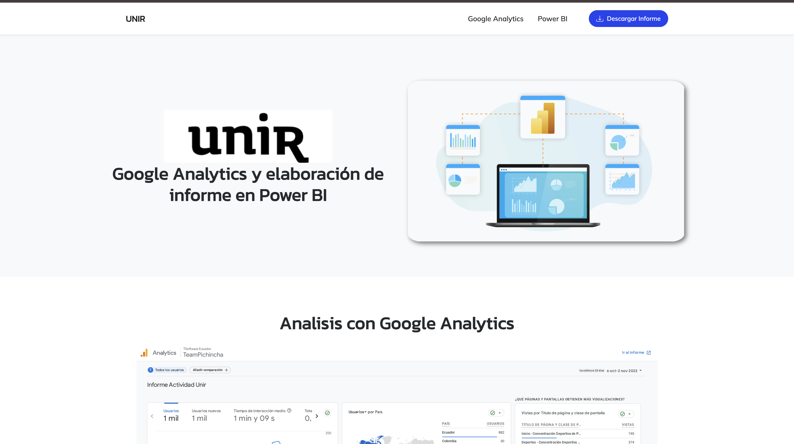

  

# Google Analytics y elaboración de informe en Power BI

  

## Descripción del Proyecto

Este proyecto integra técnicas de recopilación de datos y analítica web con visualización avanzada mediante herramientas de Business Intelligence. Se compone de dos secciones principales:

1. **Análisis con Google Analytics**: Obtención de insights valiosos y monitoreo de tráfico a través de Google Analytics.
2. **Dashboard Interactivo en Power BI**: Una representación visual y analítica de los datos de una tienda virtual, permitiendo tomar decisiones informadas gracias al uso de Microsoft Power BI.

### Características
- **Arquitectura MVC**: Código JavaScript estructurado usando el patrón Modelo-Vista-Controlador.
- **Diseño de Analista de Datos**: Interfaz moderna, limpia y profesional con componentes responsivos, ideal para dashboards y presentaciones corporativas.
- **Previsualización de Informes**: Modal integrado para visualizar el informe PDF directamente en la web antes de proceder a la descarga.

---
**Data Analytics Portfolio - Edwin Daniel Valencia Martinez**
